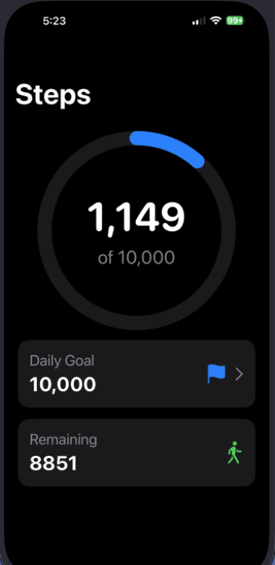
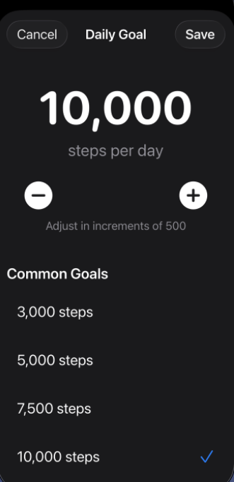

# StepCounterApp

<p align="center">
  
</p>

A SwiftUI companion for daily movement that surfaces your live step count, visualizes progress toward a customizable goal, and nudges you when the finish line is in sight. The app is intentionally modular—views remain lightweight, while dedicated view models, services, and stores own motion data, goal persistence, and notification scheduling.

## Preview
<p align="center">
  
  
</p>

## Features
- Live pedometer feed powered by Core Motion with graceful fallbacks on simulators.
- Circular progress visualization with configurable daily goal.
- Goal editor sheet that validates input, persists to `UserDefaults`, and syncs instantly with the dashboard.
- Daily completion tracking plus notification hooks for celebration reminders.
- Modular architecture (Views ▸ ViewModels ▸ Services ▸ Stores) for easier testing and future expansion.

## Requirements
- Xcode 15+
- iOS 17 SDK
- Device with motion sensors for true step data (the simulator provides placeholder values)

## Getting Started
1. Clone or download this repository.
2. Open the Xcode project:
   ```bash
   open StepCounterApp.xcodeproj
   ```
3. Choose the `StepCounterApp` scheme and run on an iPhone simulator or a physical device.
4. Approve the Motion & Fitness permission prompt to stream real pedometer readings.

## Build & Test
- Reproducible CI build:
  ```bash
  xcodebuild -scheme StepCounterApp -destination 'platform=iOS Simulator,name=iPhone 15' clean build
  ```
- Run the XCTest suite:
  ```bash
  xcodebuild test -scheme StepCounterApp -destination 'platform=iOS Simulator,name=iPhone 15'
  ```
- Attach `-resultBundlePath` when you need to archive logs from CI jobs.

## Project Structure
- `StepCounterApp/StepCounterAppApp.swift` – App lifecycle entry point configuring shared dependencies.
- `StepCounterApp/ContentView.swift` – Primary dashboard showing steps, goal progress, and controls.
- `StepCounterApp/ViewModels/StepCounterViewModel.swift` – Orchestrates Core Motion data, goal logic, and view state.
- `StepCounterApp/Views/` – Supplemental SwiftUI screens such as the goal editor sheet.
- `StepCounterApp/Services/` – Wrappers around `CMPedometer`, notifications, and any future health sources.
- `StepCounterApp/Stores/GoalStatusStore.swift` – Persists daily achievements with `UserDefaults`.
- `StepCounterApp/Assets.xcassets/` – App icon, color sets, and other shared media.

## Configuration Notes
- Ensure the `Privacy - Motion Usage Description` (`NSMotionUsageDescription`) string reflects how the app uses health data; localize if needed.
- Link any additional frameworks (CoreMotion, HealthKit, UserNotifications) directly inside `StepCounterApp.xcodeproj ▸ Frameworks, Libraries, and Embedded Content`.
- Separate Debug and Release configurations let you inject mock pedometer data without affecting production builds.

## Testing Guidelines
- Add unit and UI tests under `StepCounterAppTests/` or `StepCounterAppUITests/`, following the `FeatureNameTests` and `test_whenCondition_expectOutcome` naming style.
- Run `xcodebuild test` before pushing changes, and capture simulator/device coverage for flows gated by motion permissions.

## Troubleshooting
- **Simulator zeros for steps:** Simulators cannot access real pedometer data. Use a physical device to validate live motion readings.
- **Notification requests ignored:** Confirm notifications are enabled in Settings ▸ StepCounterApp and that `UNUserNotificationCenter` permissions succeeded.
- **Permission prompt never appears:** Reset permissions via Settings ▸ General ▸ Transfer or Reset iPhone ▸ Reset Location & Privacy, then relaunch the app.
